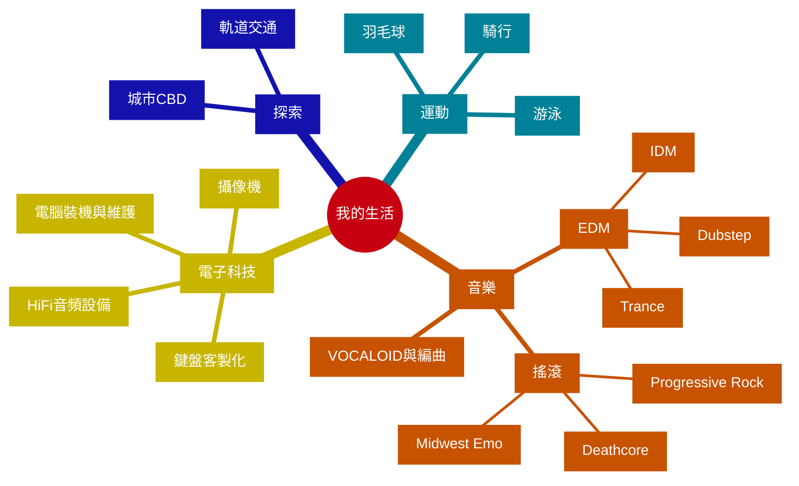

<!-- Banner -->

  

<!-- Typing SVG intro -->

  <a href="https://git.io/typing-svg">
    
  

---

## About Me

大家好，我是 Qin Anze（a.k.a. Robin）。

我是一個常年出沒在江浙滬皖地區的學生，主修方向是合成生物學、藥學與 AI4Science。雖然主業不在計算機，但程式設計對我來說是興趣。我高度依賴 AI coding 工具來建構有意義的東西。

---

## Tech Stack

### Core Languages 核心編程語言

  
  
  
  

### Currently Learning 正在學習

  
  
  

### Workflow 日常工具鏈

  
  
  
  
  
  
  

---

## My Life btw

---

  發自我的手機 
  Last updated: 2026-08-08

