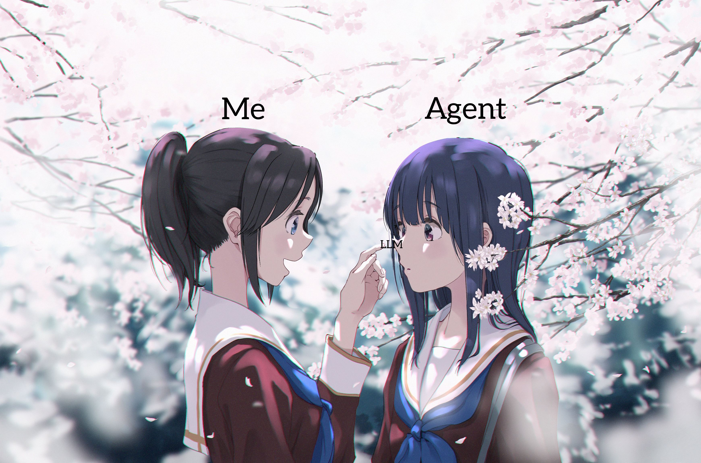
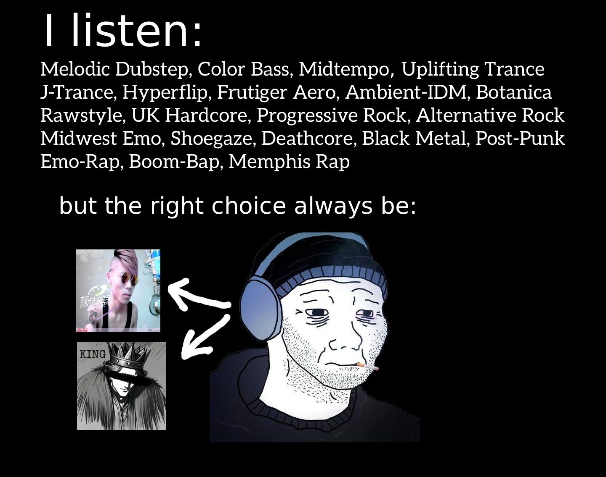

<!-- Banner -->
<p align="center">
  
</p>

<!-- Typing SVG intro -->
<p align="center">
  <a href="https://git.io/typing-svg">
    
  </a>
</p>

---

## About Me

大家好，我是 Qin Anze（a.k.a. Robin）。

我是一個常年出沒於江浙滬皖地區的學生。目前的「主業」是合成生物學（Synthetic Biology）與 AI4Science，同時也投入生物資訊學（Bioinformatics）與各類組學（Omics）的研究；未來希望能進入製藥（Pharmacy）產業，把實驗室裡的發現真正轉化成臨床與產品價值。

說實話，我並沒有受過正式的電腦科學（Computer Science）訓練——當初選擇生物，就是因為更想鑽研生命科學本身，而不是去學寫程式。不過，AI 的出現改變了這件事：如今有了 AI Coding 工具的輔助，我能以相對快的速度補上計算機與程式設計的缺口，邊做邊學。某種程度上，這也算圓了小時候想「動手造出東西」的夢。

---

## My Chaotic Space

### Artist Persona


### Underwater Man

#### Programming Languages

<p>
  
  
  
  
  
  
  
</p>

#### AI Tools

<p>
  
  
  
</p>

#### Dev Tools

<p>
  
  
  
  
  
  
  
  
  
  
</p>

#### Knowledge & Writing

<p>
  
  
  
  
  
  
</p>

#### Hardware I Use

<p>
  
  
  
</p>

---

## Life & Hobbies

### Choose life?!

```kotlin
/**
 * @author QinAnze
 * @profile https://github.com/QinAnze
 */

data class Sports(
    val hobby_1: String = "Badminton",
    val hobby_2: String = "Swimming",
    val hobby_3: String = "Running",
    val hobby_4: String = "Motorsport"
)

data class Tech(
    val hobby_1: String = "PC Build",
    val hobby_2: String = "Server",
    val hobby_3: String = "HiFi",
    val hobby_4: String = "Keyboard",
    val hobby_5: String = "Auto Tuning"
)

data class Explore(
    val hobby_1: String = "CBD",
    val hobby_2: String = "Architecture",
    val hobby_3: String = "Photography"
)

data class Transit(
    val hobby_1: String = "High‑Speed Railway",
    val hobby_2: String = "Metro"
)

data class Society(
    val hobby_1: String = "Politics",
    val hobby_2: String = "Economics",
    val hobby_3: String = "History"
)

data class Language(
    val hobby_1: String = "Language",
    val hobby_2: String = "Dialects"
)

```

### Music btw

<p align="center">
  
</p>

---

## Data

<div align="center">

[](https://github.com/stats-organization/github-stats-extended)

</div>

---

<p align="center">
  <sub>發自我的手機</sub><br/>
  <sub>Last updated: 2026-08-17</sub>
</p>
