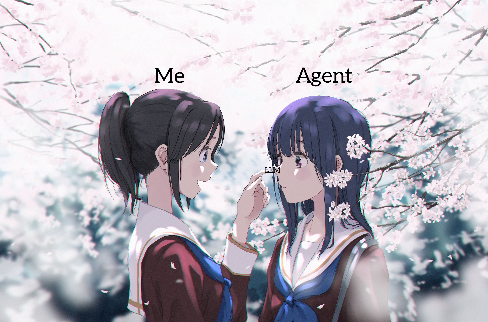

<!-- Banner -->

  

<!-- Typing SVG intro -->

  

---

## About Me

I am Qin Anze, a.k.a. Robin, an undergraduate in China.

I am studying Bioengineering, focusing on SynBio and AI4Sci. In the future, I hope to work on BioPharm and BioInfo. Outside of my biology coursework, I also do some art and design work.

This account is for personal use. ATTENTION: Contents are highly AI-generated.

---

## Chaotic Spaces

  
  
  
  
  
  
  
  
  
  
  
  
  
  
  
  
  
  
  

  &nbsp;&nbsp;
  &nbsp;&nbsp;
  &nbsp;&nbsp;
  

  &nbsp;&nbsp;
  &nbsp;&nbsp;
  &nbsp;&nbsp;
  

  &nbsp;&nbsp;
  &nbsp;&nbsp;
  &nbsp;&nbsp;
  

---

  發自我的手機 
  Last updated: 2026-10-31

